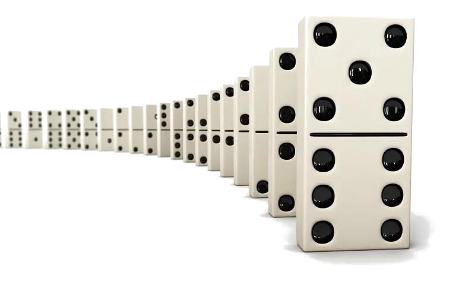
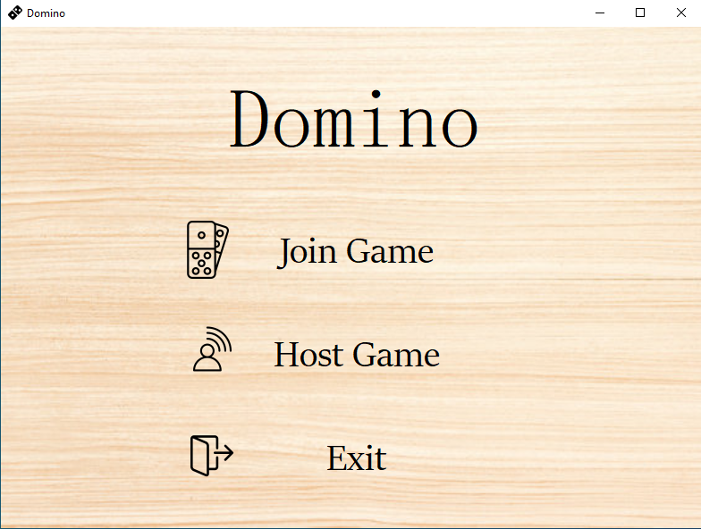
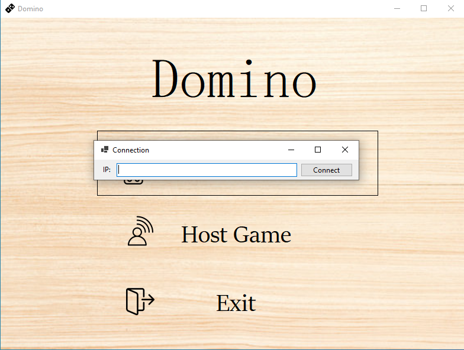
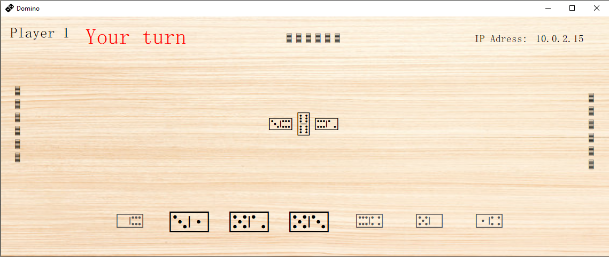

# Domino Online

---
 

# Index
- [Introducció](#Introducció)
- [Controladors](#controladors)
  - [Menú](#menú)
  - [Servidor](#servidor)
  - [Client](#client)
    - [Configuració](#configuració)
    - [Jugabilitat](#jugabilitat)
- [Vistes](#vistes)
  - [Vista del menú](#vista-del-menú)
  - [Formulari per afegirse a una partida](#formulari-per-afegirse-a-una-partida)
  - [Tauler de la partida](#tauler-de-la-partida)
- [Model](#model)
  - [Jugador](#jugador)

# Introducció

Aquest Domino Online és per exclusivament 4 jugadors, i funciona amb P2P (peer-to-peer), per tant no necessita d'un servidor aliè, només cal que una persona allotji la partida i comparteixi la seva direcció IP amb la resta de jugadors.

# Controladors

Aquest respon a esdeveniments (usualment accions de l'usuari) i invoca peticions al 'model' quan es fa alguna sol·licitud sobre la informació (per exemple, editar un document o un registre en una base de dades). També pot enviar comandes a la 'vista' associada si es sol·licita un canvi en la forma en què es presenta el 'model' (per exemple, desplaçament o scroll per un document o per diferents registres d'una base de dades), per tant es podria dir que el 'controlador' fa d'intermediari entre la 'vista' i el 'model' .

## Menú

Al controlador del menú s'han de gestionar els events de els 3 botons diferents que hi apareixen

## Servidor

Al servidor gestionem les funcions del servidor, desde la creació fins el manejament dels missatges.

## Client

Al client es tradueix l'informació arribada del servidor i s'envia a la vista per que aquesta la presenti de manera adequada.

### Configuració

### Jugabilitat

# Vistes

Aquestes son la representació de la informació amb la qual el sistema opera, per tant gestiona tots els accesos a aquesta informació, tant consultes com actualitzacions, implementant també els privilegis d'accés que s'hagin descrit en les especificacions de l'aplicació

## Vista del menú

 
 
 

## Formulari per afegirse a una partida

 
 
 

## Tauler de la partida

 
 
 

# Model

Aquest presenta el 'model' en un format adequat per a interactuar (usualment la interfície d'usuari) per tant cal que proveeixi la informació de sortida del 'model'.

## Jugador

El model del jugador tan sols necessita 2 arguments, el torn del jugador per identificar-ho i la connexió amb el servidor:

    internal class Player
    {
        public WebSocket ws { get; set; }
        public int turn { get; set; }

        public Player(WebSocket ws, int turn)
        {
            this.ws = ws;
            this.turn = turn;
        }
    }
